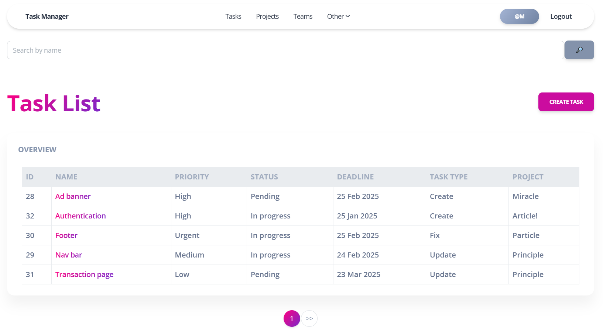

# Task Manager

The Task Manager is a Django-based web application designed to optimize and effectively manage tasks within an IT company. It provides a centralized platform for task distribution, tracking, and collaboration across projects and teams.

## Check it out!

[Task Manager project deployed to Render](https://task-manager-zv41.onrender.com)

**Test credentials**:
* **Username:** test_user
* **Password:** Test_pass_123

## Installation

Python3 must be already installed

```shell
git clone https://github.com/mykola-tarasenko/task-manager
cd task-manager
python3 -m venv venv
source venv/bin/activate
pip install -r requirements.txt
python manage.py runserver # starts Django Server
```

## Features

* Authentication functionality for Worker/User.
* Managing tasks, task types, projects, teams, workers & positions.
* Powerful admin panel for advanced managing.

## Demo


